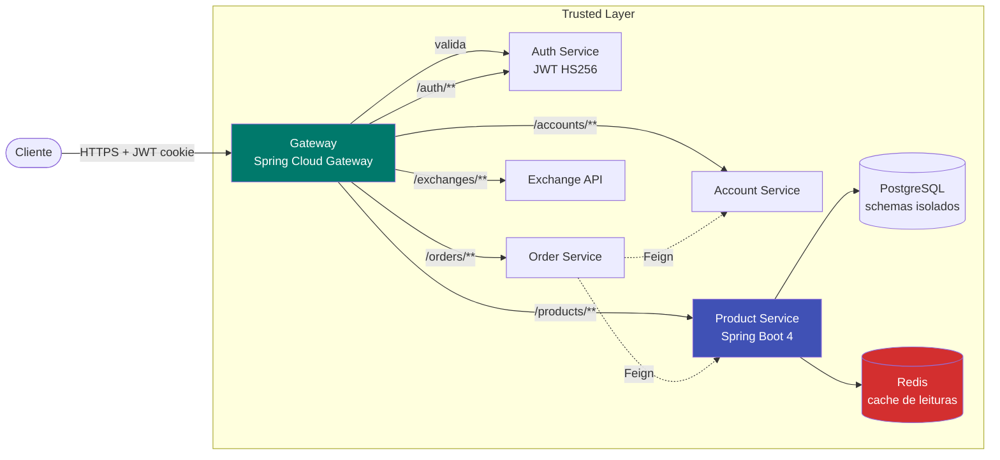
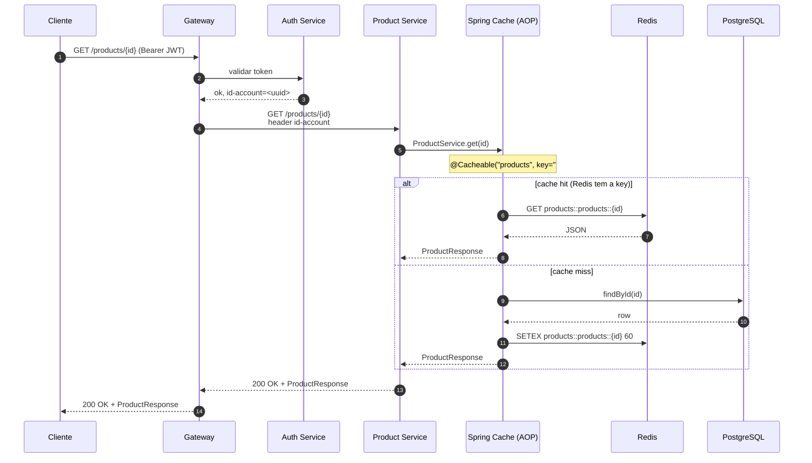

# Architecture

## Visão da plataforma



**Princípios:**

- **Gateway como única porta externa.** O `Product Service` nunca recebe tráfego direto da internet.
- **JWT validado uma vez.** O Gateway valida o token e injeta o header `id-account` antes de encaminhar.
- **Schemas isolados.** Cada serviço tem seu schema PostgreSQL próprio (`products`, `accounts`, `orders`) — isolamento lógico sem o custo operacional de múltiplas instâncias.
- **Redis compartilhado com prefixos.** A key `products::products::{uuid}` evita colisão se outros serviços usarem o mesmo cluster.

---

## Fluxo de requisição



A camada `Spring Cache (AOP)` é injetada automaticamente por Spring Boot quando o método é anotado com `@Cacheable`. Não há código de cache escrito à mão — só configuração e annotations.

---

## Estrutura de pacotes

```
src/main/java/store/product/
├── ProductApplication.java     # @SpringBootApplication — entrypoint
├── ProductController.java      # @RestController @RequestMapping("/products")
│                               # Lê @RequestHeader("id-account"), valida @RequestBody
├── ProductService.java         # @Service com regras de negócio
│                               # @Cacheable / @CachePut / @CacheEvict
├── ProductRepository.java      # extends JpaRepository<Product, UUID>
│                               # + findByNameContainingIgnoreCase
├── Product.java                # @Entity @Table("product")
│                               # id UUID @GeneratedValue
├── ProductRequest.java         # record com @NotBlank / @NotNull / @Positive
├── ProductResponse.java        # record + static from(Product)
└── CacheConfig.java            # @Configuration @EnableCaching
                                # bean RedisCacheManager (TTL 60s, prefix products::)

src/main/resources/
├── application.yaml            # datasource + redis + actuator + cache
└── db/migration/
    └── V1__create_products_table.sql

k8s/                            # Manifests Kubernetes
├── configmap.yaml              # DATABASE_HOST/PORT/DB, REDIS_HOST/PORT
├── secrets.yaml                # DATABASE_USERNAME/PASSWORD (base64)
├── deployment.yaml             # 1 container, requests 256Mi/250m, limits 512Mi/500m
├── service.yaml                # ClusterIP porta 8080
└── hpa.yaml                    # 1–5 réplicas, target 50% CPU
```

---

## Modelo de dados

Schema **`products`** isolado no Postgres. Criação automática via `spring.flyway.schemas: products`.

```sql
-- V1__create_products_table.sql
CREATE TABLE IF NOT EXISTS products.product (
    id      UUID         PRIMARY KEY DEFAULT gen_random_uuid(),
    name    VARCHAR(255) NOT NULL,
    price   NUMERIC(10, 2) NOT NULL,
    unit    VARCHAR(50)  NOT NULL
);
```

| Coluna | Tipo | Decisão |
|---|---|---|
| `id` | `UUID` (PK, default `gen_random_uuid()`) | Geração no banco — o JPA recebe o id no INSERT sem precisar de roundtrip extra |
| `name` | `VARCHAR(255) NOT NULL` | Suficiente para nomes de produtos; indexável se for necessário (search por nome usa `LIKE %x%` sem índice) |
| `price` | `NUMERIC(10, 2) NOT NULL` | Até 99.999.999,99 — precisão financeira garantida com `BigDecimal` no Java |
| `unit` | `VARCHAR(50) NOT NULL` | Unidade livre (`kg`, `un`, `L`, `slice`, etc) sem enum — flexibilidade > validação rígida |

---

## Decisões de design

| Decisão | Motivo |
|---|---|
| **Spring Boot 4.0.3 + Java 25** | Stack moderna; `ProblemDetails` RFC 7807 nativo via `spring.mvc.problemdetails.enabled` |
| **JWT validado no Gateway, não no serviço** | Reduz latência; serviço confia no header `id-account` injetado; perímetro de segurança bem-definido |
| **Redis vs cache local (`Caffeine`)** | Coerência automática entre réplicas — quando HPA escala de 1 para 5 pods, todos compartilham o mesmo estado de cache |
| **`RedisCacheManager` custom (não default)** | TTL explícito de 60s; prefixo `products::` evita colisão; serialização JSON legível no `redis-cli` |
| **`BigDecimal` mapeado para `NUMERIC(10,2)`** | Sem perda de precisão de `double` em operações financeiras |
| **`@CachePut` em `create` (não só `@Cacheable` em `get`)** | Elimina o primeiro cache miss; o produto já entra cacheado |
| **`@CacheEvict` em `delete` (não esperar TTL)** | Garante que um `GET` após `DELETE` veja 404 imediatamente |
| **`list(name)` sem cache** | Listas mudam com frequência (catálogo cresce); cache invalida-se rápido demais para compensar |
| **Records (`ProductRequest`/`ProductResponse`)** | Imutáveis, concisos, com `equals/hashCode/toString` automáticos |
| **`JpaRepository`** (não `CrudRepository`) | Métodos extras úteis (`findAll(Pageable)`, derived queries como `findByNameContainingIgnoreCase`) |

---

## Tratamento de erros

| Cenário | Status | Response |
|---|---|---|
| `name` vazio, `price ≤ 0`, `unit` vazia | `400 Bad Request` | ProblemDetails com `detail: "Validation failed"` |
| `id-account` header ausente | `400 Bad Request` | ProblemDetails — header obrigatório |
| `GET`/`DELETE` em `id` inexistente | `404 Not Found` | `ResponseStatusException(NOT_FOUND, "Product not found")` |
| `id` no path com formato inválido (não-UUID) | `400 Bad Request` | Spring conversion error |
| Redis indisponível | `500 Internal Server Error` | Fail-fast (não há fallback gracioso configurado) |
| Postgres indisponível | `500 Internal Server Error` | JPA propaga `DataAccessException` |

ProblemDetails é o formato canônico (RFC 7807). Habilitado via:

```yaml
spring:
  mvc:
    problemdetails:
      enabled: true
```

---

## Empacotamento e deploy

### Imagem Docker

`Dockerfile` baseado em `eclipse-temurin:25` (Java 25 oficial). A imagem é construída em duas etapas:

1. `mvn clean package` localmente → produz `target/product-service-1.0.0.jar`
2. `docker build` → imagem com o jar.

### Kubernetes

Manifests versionados em `k8s/`:

- **`deployment.yaml`** — 1 container, recursos: `requests 256Mi/250m`, `limits 512Mi/500m`, env vars vindas do ConfigMap (DB host/port/db, Redis) e Secret (DB user/password).
- **`service.yaml`** — `ClusterIP` na porta 8080, expõe apenas internamente.
- **`configmap.yaml`** — config não-sensível.
- **`secrets.yaml`** — credenciais em base64. **Trocar antes de aplicar em produção.**
- **`hpa.yaml`** — `HorizontalPodAutoscaler` 1–5 réplicas com target de 50% CPU.

### Local (Docker Compose)

`compose.yaml` na raiz sobe Postgres + Redis + product em uma rede só, com healthchecks. Suficiente para desenvolvimento e demonstração — ver [Development](development.md).
