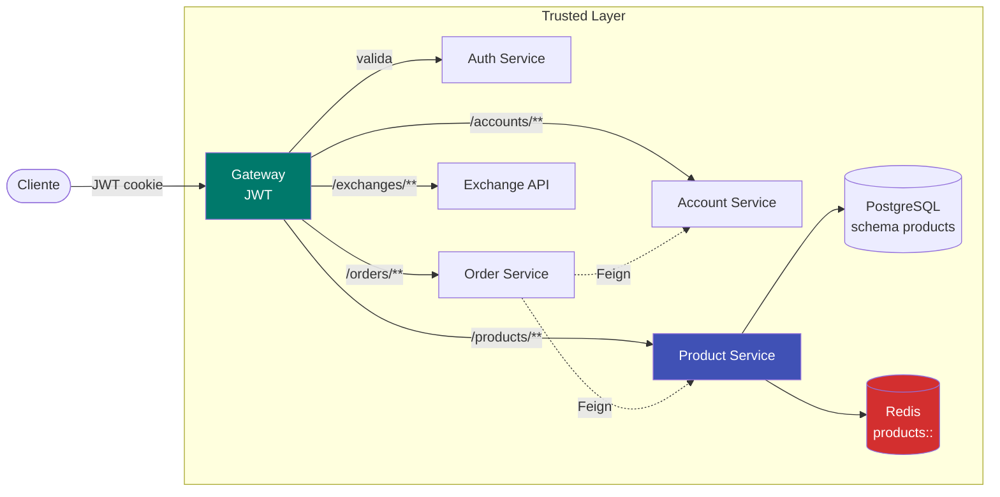
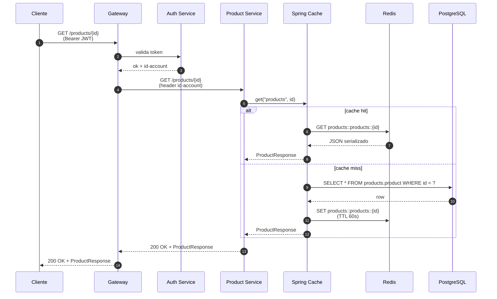

# Product API — Nathan

???+ info inline end "Edição"

    2026.1

**Aluno:** Nathan Benaion
**Grupo:** Henry Idesis · Nathan Benaion · Kauã Makiyama
**Disciplina:** Plataformas, Microserviços e APIs — Insper 2026.1
**Professor:** Humberto Sandmann

---

## Sobre o projeto

O projeto é uma plataforma de comércio digital distribuída em microsserviços. A loja permite que usuários autenticados consultem um catálogo de produtos, façam pedidos em diferentes moedas e tenham suas transações persistidas com integridade. Cada integrante do grupo é responsável por ao menos um microsserviço.

Este repositório contém o **Product API** — o serviço responsável pelo **catálogo de produtos** da loja: criação, listagem (com filtro opcional por nome), consulta individual e remoção. É a fonte de verdade que o `order-service` consulta para enriquecer os itens de cada pedido com nome e preço atualizados.

Para suportar a carga típica de catálogos (poucas escritas, muitas leituras repetidas dos mesmos `id`), o serviço implementa **cache em Redis** com TTL de 60 segundos e expõe **métricas Prometheus** via Spring Actuator. Detalhes em [Bottlenecks](bottlenecks.md).

---

## Entregas

| Atividade | Status | Onde |
|---|---|---|
| Product API — CRUD em `/products` | ✅ Concluído | [API Reference](api.md) |
| Persistência PostgreSQL + Flyway | ✅ Schema isolado `products` | [Architecture](architecture.md) |
| Cache Redis com `@Cacheable` / `@CachePut` / `@CacheEvict` | ✅ TTL 60s, prefixo `products::` | [Bottlenecks](bottlenecks.md) |
| Bottleneck #1 — Cache Redis | ✅ **8× speedup** mensurado (26ms → 4ms) | [Bottlenecks](bottlenecks.md) |
| Bottleneck #2 — Métricas Prometheus | ✅ `/actuator/prometheus` + `/caches/products` | [Bottlenecks](bottlenecks.md) |
| Kubernetes manifests (HPA 1–5 réplicas) | ✅ `k8s/` versionado | [Architecture](architecture.md) |
| Pipeline CI/CD (Jenkins → Docker Hub) | ✅ multi-arquitetura arm64/amd64 | [Development](development.md) |
| Documentação MkDocs Material + GitHub Pages | ✅ Site público (este) | — |

---

## Repositórios

!!! tip "Código-fonte e documentação publicada"

    | Recurso | Link |
    |---|---|
    | Repositório do Product API | [github.com/microservice-henry/pma.261.product](https://github.com/microservice-henry/pma.261.product){:target="_blank"} |
    | Site de documentação (este) | [microservice-henry.github.io/pma.261.product](https://microservice-henry.github.io/pma.261.product/){:target="_blank"} |
    | Plataforma (visão agregada do grupo) | [microservice-henry/pma.26.1.exchange](https://github.com/microservice-henry/pma.26.1.exchange){:target="_blank"} |

---

## Arquitetura geral

O **Product Service** vive no `Trusted Layer` (rede interna). Todo tráfego externo passa pelo **Gateway**, que valida o JWT e injeta o header `id-account` antes de encaminhar. Internamente, o `order-service` consome o product via Feign para enriquecer cada item de pedido.

---

## Fluxo de uma requisição

Em uma carga repetitiva (3 GETs no mesmo `id`), as métricas mostram **1 INSERT no Postgres** e **0 SELECTs por findById** — o cache absorve 100% das leituras subsequentes dentro do TTL. Ver detalhes em [Bottlenecks](bottlenecks.md).
